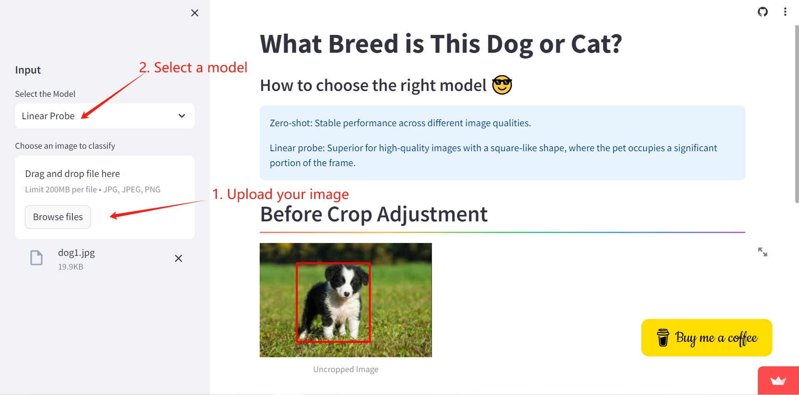
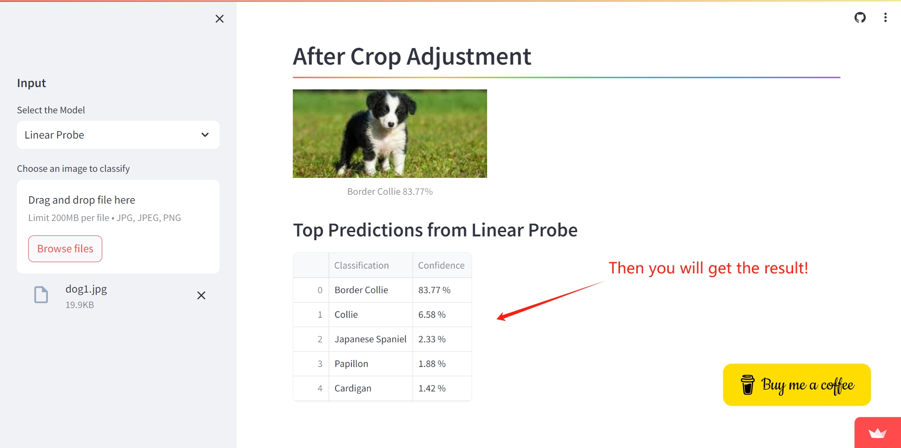

# cats-and-dogs-classification （Version 1.0）

## **Developers:**

**Kexian Wu**: App development, YOLO object detection, Clip-zero shot, Clip-linear probe.

**Jialong Li**: Model training, Clip-zero shot, Clip-linear probe, Fine-tuned ResNet.  

## **The link of the APP:**

<https://cats-and-dogs-classification.streamlit.app>

## **How to use the App:**
### 1. Upload you Image, and choose a model.

### 2. You are all set, check out the result of top-5 predictions!

## **Project desciption:**

Dogs and cats are the most popular pets in the United States. More than just satisfying curiosity, understanding your pet's breed can provide valuable insights into their behavior.

In the pet breed recognition project, we compared the accuracy of OpenAI **CLIP** zero-shot recognition based on **ResNet** and **ViT** encoder, and ViT wins in all cases. Then training a **linear probe CLIP** boosted accuracy from 80% to 89%. Additionally, we **Fine-tuned** a **ResNet50** model which further improved accuracy to 93%.

In the app, we employed **YOLOv5** to remove the background from images and resize them into squares while preserving the aspect ratio through padding to match the input size required by the Convolutional Neural Network. YOLOv5 can also detect whether the input image contains cats and dogs, ensuring that the model avoids generating inappropriate responses. Unfortunately, due to RAM constraints, we couldn't include the fine-tuned ResNet50 model in the app.

We selected Oxford Pets[1] as our initial training dataset and expanded the breed diversity from 37 to 184 by incorporating the Kaggle Cat Breeds dataset[2] and the Stanford Dogs dataset[3]. While our application excels in dog breed classification, it currently has relatively lower accuracy in cat breed classification. This can be attributed to the very low quality of the Kaggle Cat Breeds dataset. We are actively seeking a better cat breeds dataset to enhance the overall performance of our application.

Furthermore, after discussions with zoology experts at Virginia Tech, it has been noted that the taxonomy criteria for the Kaggle cat model are highly disorganized. We all involve collaboration with more experts in zoology and biology field for the next version. 

## **Datasets:**
[1] https://www.robots.ox.ac.uk/~vgg/data/pets/

[2] https://www.kaggle.com/datasets/ma7555/cat-breeds-dataset/data

[3] http://vision.stanford.edu/aditya86/ImageNetDogs/
